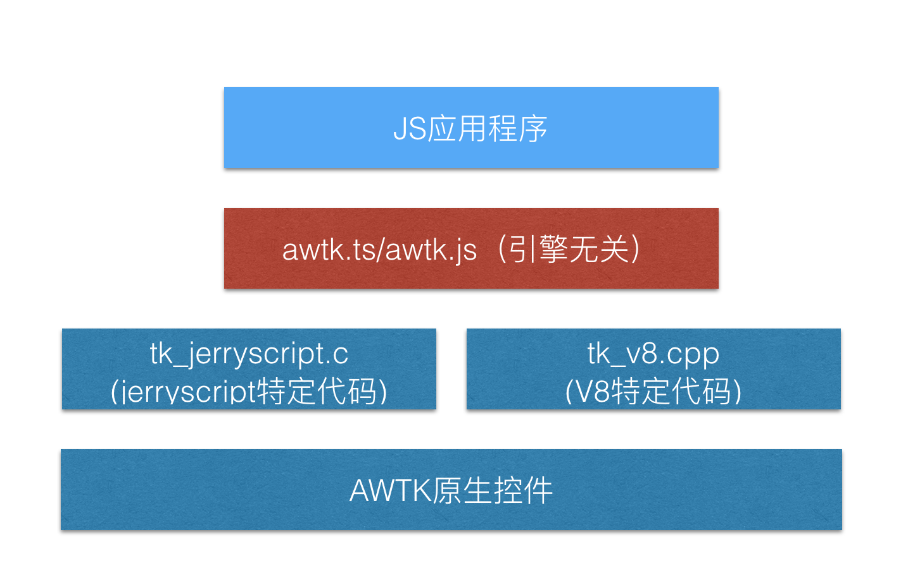

## Javascript绑定


### 一、基本架构

Javascript的绑定方法和lua的绑定方法有些不同，主要原因是javascript的引擎有很多种，比如嵌入式系统常用的jerryscript和PC上常用的V8。不同的引擎提供注册C/C++函数的能力不同，所以在绑定时我们只对引擎做一个最低能力的要求：提供注册全局函数的能力。

我们把绑定的代码分两层：

* 引擎相关的代码负责把awtk的函数一一映射到js层面。

* 引擎无关的代码(awtk.ts)负责把awtk的函数包装成面向对象的接口。 

基本架构如下：



这样的好处有：

* 实现简单。绑定全局函数是最简单的，而且每种引擎都有大量的示例可以参考。

* 代码的重用度高。awtk.ts的代码产生器只需要一份即可。

* 为上层提供一个统一的接口，换javascript引擎不会对上层应用程序造成影响。

### 二、引擎相关的代码(jerryscript为例)

#### 1.成员函数的绑定

C语言里面的成员函数其实都是全局函数，按全局函数的绑定方式绑定即可，构造函数和非构造函数按同样的方式处理。如：

```
jerry_value_t wrap_button_create(const jerry_value_t func_obj_val, const jerry_value_t this_p,
                                 const jerry_value_t args_p[], const jerry_length_t args_cnt) {
  widget_t* ret = NULL;
  widget_t* parent = (widget_t*)jerry_get_pointer(args_p[0], "widget_t*");
  xy_t x = (xy_t)jerry_get_number_value(args_p[1]);
  xy_t y = (xy_t)jerry_get_number_value(args_p[2]);
  wh_t w = (wh_t)jerry_get_number_value(args_p[3]);
  wh_t h = (wh_t)jerry_get_number_value(args_p[4]);
  ret = (widget_t*)button_create(parent, x, y, w, h);

  return jerry_create_pointer(ret, "button_t*");
};
```

```
jerryx_handler_register_global((const jerry_char_t*)"button_create", wrap_button_create);
```

#### 2.对象属性的绑定
对象的属性转换成set/get函数，再按全局函数注册。

```
jerry_value_t wrap_widget_t_set_prop_visible(const jerry_value_t func_obj_val,
                                             const jerry_value_t this_p,
                                             const jerry_value_t args_p[],
                                             const jerry_length_t args_cnt) {
  widget_t* obj = (widget_t*)jerry_get_pointer(args_p[0], "widget_t*");
  bool_t visible = (bool_t)jerry_get_boolean_value(args_p[1]);
  obj->visible = visible;
  return jerry_create_number(RET_OK);
}

jerry_value_t wrap_widget_t_get_prop_visible(const jerry_value_t func_obj_val,
                                             const jerry_value_t this_p,
                                             const jerry_value_t args_p[],
                                             const jerry_length_t args_cnt) {
  widget_t* obj = (widget_t*)jerry_get_pointer(args_p[0], "widget_t*");

  return jerry_create_boolean(obj->visible);
  
}
```

```
  jerryx_handler_register_global((const jerry_char_t*)"widget_t_set_prop_visible",
                                 wrap_widget_t_set_prop_visible);
  jerryx_handler_register_global((const jerry_char_t*)"widget_t_get_prop_visible",
                                 wrap_widget_t_get_prop_visible);
```

#### 3.常量的绑定

常量的绑定，对每一个常量提供一个get函数即可。如：

```
jerry_value_t get_WIDGET_PROP_MAX_W(const jerry_value_t func_obj_val, const jerry_value_t this_p,
                                    const jerry_value_t args_p[], const jerry_length_t args_cnt) {
  return jerry_create_string_from_utf8((const jerry_char_t*)WIDGET_PROP_MAX_W);
}
```

```
jerryx_handler_register_global((const jerry_char_t*)"WIDGET_PROP_MAX_W", get_WIDGET_PROP_MAX_W);
```


### 三、引擎无相关的代码

1.类的封装

* 每个类都有一个nativeObj成员，用来保存C语言中对象的句柄，在构造时传入。

* 每个类都有一个静态的create函数，它负责调用C语言中的构造函数，并创建JS对象。

```
class Bitmap {
 public nativeObj;
 constructor(nativeObj) {
   this.nativeObj = nativeObj;
 }

 static create() {
   return new Bitmap(bitmap_create());
 }
 ...
}
```

2.对象属性的封装

这里利用了Typescript的set/get函数，实现起来非常方便：

```
 set visible(value) {
   widget_t_set_prop_visible(this.nativeObj, value);
 }

 get visible() {
   return widget_t_get_prop_visible(this.nativeObj);
 }
```

3.成员函数封装

自动使用nativeObj作为成员函数的第一个参数，然后调用绑定的C函数。

```
 layout() {
   return widget_layout(this.nativeObj);
 }
```

4.常量的封装

常量封装为枚举，幸运的是，Typescript枚举可以是数字类型，也可以是字符串类型，实现起来非常方便。

```
enum AlignV {
 NONE = ALIGN_V_NONE(),
 MIDDLE = ALIGN_V_MIDDLE(),
 TOP = ALIGN_V_TOP(),
 BOTTOM = ALIGN_V_BOTTOM(),
};
```

```
enum WidgetProp {
 X = WIDGET_PROP_X(),
 Y = WIDGET_PROP_Y(),
 W = WIDGET_PROP_W(),
 H = WIDGET_PROP_H(),
 ...
};
```

### 四、自动代码产生器

所有代码均由自动代码产生器根据awtk的IDL生成，具体请参考：tools/js_gen；

* index.js负责产生引擎无关的代码。
* jerryscript.js负责产生jerryscript相关的代码。

### 五、使用示例

```
function applicationInit() {
  var win = Window.create(null, 0, 0, 0, 0); 
  var ok = Button.create(win, 0, 0, 0, 0); 

  ok.setText("ok");
  ok.setSelfLayoutParams("center", "middle", "50%", "30");

  ok.on(EventType.CLICK, function(evt) {
    var e = PointerEvent.cast(evt);
    print("on click: " + e.x + " " + e.y);

    return Ret.OK;
  }); 

  win.layout();
}

applicationInit()
```

更多示例请参考: demos
